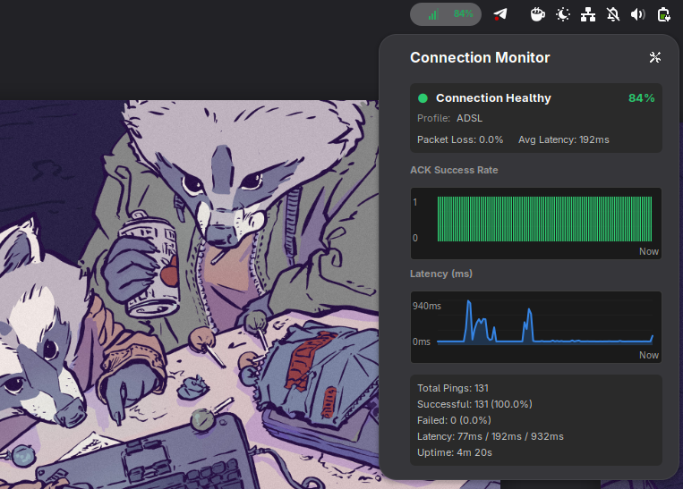

# Network Connection Quality Monitor



A GNOME Shell extension that monitors your network connection quality in real-time, providing visual feedback through signal strength icons and detailed statistics.

> **Note:** This extension is developed and tested on GNOME 50 / Wayland with Ubuntu 26.04 LTS (development branch).


## Features

### For Everyday Users

- **Visual Signal Indicator**: See your connection quality at a glance in the system panel with signal bars (0-4 bars) that change based on connection quality
- **Color-Coded Status**: 
  - 🟢 Green = Excellent connection
  - 🟡 Yellow = Fair connection  
  - 🟠 Orange = Poor connection
  - 🔴 Red = Connection dropped or critical
- **Quick Access Panel**: Click the indicator to open a detailed panel showing:
  - Current connection status
  - Quality percentage
  - Active profile
  - Packet loss and average latency
- **Sound Alerts**: Optional audio notifications when connection drops or restores [Planed, not working now]
- **Theme Support**: Automatically adapts colors for dark and light themes

### For Technical Users

- **Real-time Graphs**: 
  - ACK Success Rate graph showing packet acknowledgment over time
  - Latency graph displaying response times in milliseconds
- **Detailed Statistics**:
  - Total pings sent
  - Successful vs failed pings with percentages
  - Latency range (min/avg/max)
  - Connection uptime tracking
- **Multiple Connection Profiles**: Optimized settings for different network types
- **Customizable Settings**: Configure ping intervals, targets, and alert preferences

## Installation

### From GNOME Extensions Website (Recommended)

1. Visit the [extension page on extensions.gnome.org](https://extensions.gnome.org/extension/XXXX/)
2. Toggle the switch to install
3. The extension will appear in your system panel

### Manual Installation (Using Make)

For users comfortable with command-line tools, the extension includes a Makefile with convenient commands:

```bash
# Clone the repository
git clone https://github.com/stdevPavelmc/conn-mon.git
cd conn-mon

# Install and enable the extension
make install
make enable

# Restart GNOME Shell to activate
# X11: Alt+F2, type 'r', press Enter
# Wayland: Log out and log back in
```

**Additional Make Commands:**

| Command | Description |
|---------|-------------|
| `make install` | Install extension to `~/.local/share/gnome-shell/extensions/` |
| `make uninstall` | Remove extension files from the system |
| `make enable` | Enable the extension (use after install) |
| `make disable` | Disable the extension |
| `make status` | Show installation and enabled status |
| `make pack` | Create a ZIP package for uploading to extensions.gnome.org |
| `make logs` | Follow extension logs in real-time (Ctrl+C to exit) |
| `make clean` | Remove build artifacts and compiled schemas |

**Quick Workflow Examples:**

```bash
# Full installation and activation
make install && make enable

# Update after making changes
make install

# Check if extension is installed and enabled
make status

# View live logs for debugging
make logs

# Complete uninstallation
make disable && make uninstall
```

### Manual Installation (Traditional Method)

If you prefer not to use make:

```bash
# Clone the repository
git clone https://github.com/stdevPavelmc/conn-mon.git
cd conn-mon

# Install to local GNOME extensions directory
mkdir -p ~/.local/share/gnome-shell/extensions/conn-mon@stdevpavelmc.github.com
cp -r * ~/.local/share/gnome-shell/extensions/conn-mon@stdevpavelmc.github.com/

# Recompile schemas
glib-compile-schemas ~/.local/share/gnome-shell/extensions/conn-mon@stdevpavelmc.github.com/schemas/

# Enable the extension
gnome-extensions enable conn-mon@stdevpavelmc.github.com

# Restart GNOME Shell (Alt+F2, type 'r', press Enter on X11)
# Or log out and back in on Wayland
```

## How It Works

### Quality Rating System

The extension calculates a quality score (0-100%) based on two main factors:

1. **Packet Loss** (40% weight): The percentage of packets that fail to receive a response
2. **Latency** (60% weight): The average response time from the target server

The formula uses power decay functions for both metrics, meaning quality degrades exponentially as values deviate from expected baselines. This approach ensures that small deviations have minimal impact while larger deviations are penalized more severely.

#### Quality Thresholds

| Quality Score | Signal Bars | Description |
|---------------|-------------|-------------|
| 90-100% | 4 bars | Excellent - Perfect for all applications |
| 70-89% | 3 bars | Good - Suitable for streaming and video calls |
| 50-69% | 2 bars | Fair - Acceptable for browsing, may affect real-time apps |
| 30-49% | 1 bar | Poor - Basic connectivity only |
| 0-29% | 0 bars | Critical - Connection essentially unusable |

### Connection Profiles

The extension includes several pre-configured profiles optimized for different network types:

| Profile | Description | Expected Latency |
|---------|-------------|------------------|
| **Auto-detect** | Automatically detects connection type based on observed latency | Dynamic |
| **LAN Ethernet** | Wired local network connection | ~1ms |
| **Fiber** | Fiber ISP connection | ~5ms |
| **WiFi Local** | Local WiFi network (same LAN) | ~10ms |
| **WiFi/Tethering** | Internet via WiFi or mobile tethering | ~40ms |
| **ADSL** | DSL ISP connection | ~90ms |
| **Public/Bad WiFi** | Public or congested WiFi networks | ~300ms |

Each profile adjusts the quality calculation thresholds based on the expected latency characteristics of that connection type, ensuring accurate quality assessment regardless of your network technology.

### Why These Weights?

The 60/40 split (latency/packet loss) was chosen because:

1. **Latency is more perceptible**: Users notice high latency immediately in daily use
2. **Profile-aware scoring**: Each connection profile has different expected latency baselines, making latency a more meaningful metric
3. **Power decay functions**: Both metrics use exponential degradation, so severe packet loss still significantly impacts the overall score

## Configuration

Access settings by:
- Right-clicking or middle-clicking the panel indicator
- Using GNOME Extensions app
- Via the gear icon in the extension's dropdown panel

### Key Settings

- **Ping Target**: The server to ping (default: 8.8.8.8 - Google DNS)
- **Ping Interval**: How often to send pings (default: 2 seconds)
- **Show Percentage**: Display quality percentage next to the icon
- **Sound Alerts**: Play sounds on connection changes (not working yet)
- **Profile**: Select or auto-detect connection type

## Development

### Building from Source

```bash
# Install and enable the extension
make install && make enable

# Create a distributable ZIP package for extensions.gnome.org
make pack

# View extension logs for debugging
make logs

# See all available commands
make help
```

### Reporting Issues

Please report bugs and feature requests on the [GitHub Issues page](https://github.com/stdevPavelmc/conn-mon/issues).

### Contributing

Contributions are welcome! Please:
1. Fork the repository
2. Create a feature branch
3. Submit a pull request

## License

This extension is released under the GNU General Public License v3.0. See the [LICENSE](LICENSE) file for details.

## Credits

Developed by [stdevPavelmc](https://github.com/stdevPavelmc).

Special thanks to the GNOME Shell extension community for the excellent documentation and examples.

## Changelog

### Version 7
- Updated metadata for publication
- Improved icon sizing in panel header
- Added comprehensive documentation

### Version 6
- Initial public release with full feature set
- SVG icon support with theme adaptation
- Complete statistics and graphing system

---

**Repository**: https://github.com/stdevPavelmc/conn-mon